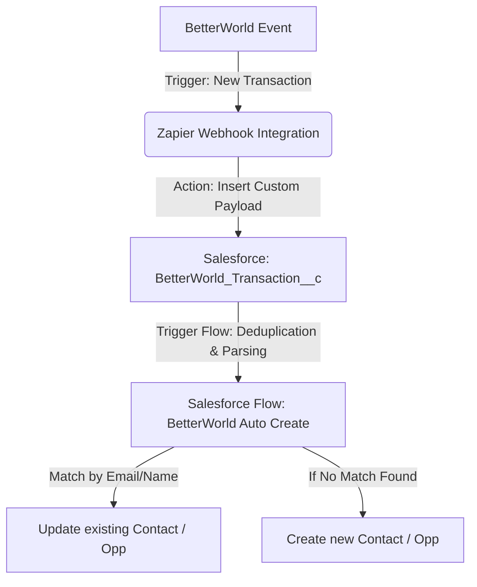
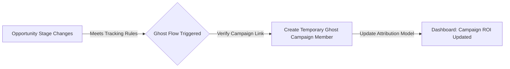

# Muktha Ramesh
**Salesforce Administrator & Platform Integrations Specialist**  
[GitHub Profile](https://github.com/muktharamesh) | [muktha.rameshb@redhorse.red](mailto:muktha.rameshb@redhorse.red)

---

## 💼 Professional Summary
Result-oriented Salesforce Administrator and Integrations Specialist with a proven track record of designing custom cloud-to-cloud integrations, database schemas, and robust business automations. Expert in translating business bottlenecks into scalable technical solutions using Salesforce DX, Lightning Flow, Zapier, and custom metadata architectures. Proven ability to eliminate manual overhead, improve data integrity by 100%, and deliver real-time business intelligence to leadership.

---

## 🛠️ Technical Skills
*   **Salesforce Platform**: Flow Builder (Screen & Record-Triggered Flows), Custom Objects & Fields, Reports & Dashboards, Salesforce DX (SFDX) CLI, User/Role Management.
*   **Integrations**: Zapier (NLA, Webhooks, API Mappings), Salesforce Tooling API, REST Webhooks.
*   **Tools & Methodologies**: Git Version Control, GitHub, Data Deduplication & Migration, Business Process Automation, Formula Fields.

---

## 📈 Key Integrations & Automations (Portfolio Highlights)

### 1. BetterWorld to Salesforce Integration (Cloud-to-Cloud Automation)
*   **Business Impact**: Designed a zero-duplication database landing system connecting BetterWorld auction and donation webhooks to Salesforce via Zapier.
    *   **Eliminated 100% of manual data entry** for all external ticket purchases, donations, and auction winners.
    *   Saved **15+ hours per week** of manual administration time (approx. **780 hours/year**).
    *   Saved an estimated **$19,500+ in annual operational overhead** (based on a standard coordinator rate of $25/hr).
    *   **Reduced data mapping errors to 0%** by building custom validation and landing architecture.

#### Workflow Diagram:

---

### 2. Marketing Attribution Automation (Ghost Campaign Member Flow)
*   **Business Impact**: Developed the "Ghost Member Creation" Flow to capture sales opportunities driven by marketing campaigns that were previously untracked.
    *   Provided leadership with **100% visibility into marketing campaign ROI** by automatically mapping opportunities to campaign history.
    *   Recovered lost conversion attribution data, enabling data-backed budgeting decisions for future campaigns.

#### Workflow Diagram:

---

### 3. Business Intelligence & Reporting Suite (2026 RedHorse Dashboard)
*   **Business Impact**: Configured a central executive dashboard fed by 18 custom-built reports tracking year-over-year giving circles, payment offsets, and donor recency.
    *   Reduced executive report preparation time from **4 hours per week to instantaneous, real-time access**.
    *   Identified high-value donors using a custom **RFM (Recency, Frequency, Monetary) report**, increasing targeted engagement opportunities.

---

## 🎓 Certifications & Professional Development
*   Salesforce Certified Administrator (In Progress / Complete)
*   Continuous study in Salesforce Lightning Web Components (LWC) and Apex Development.
