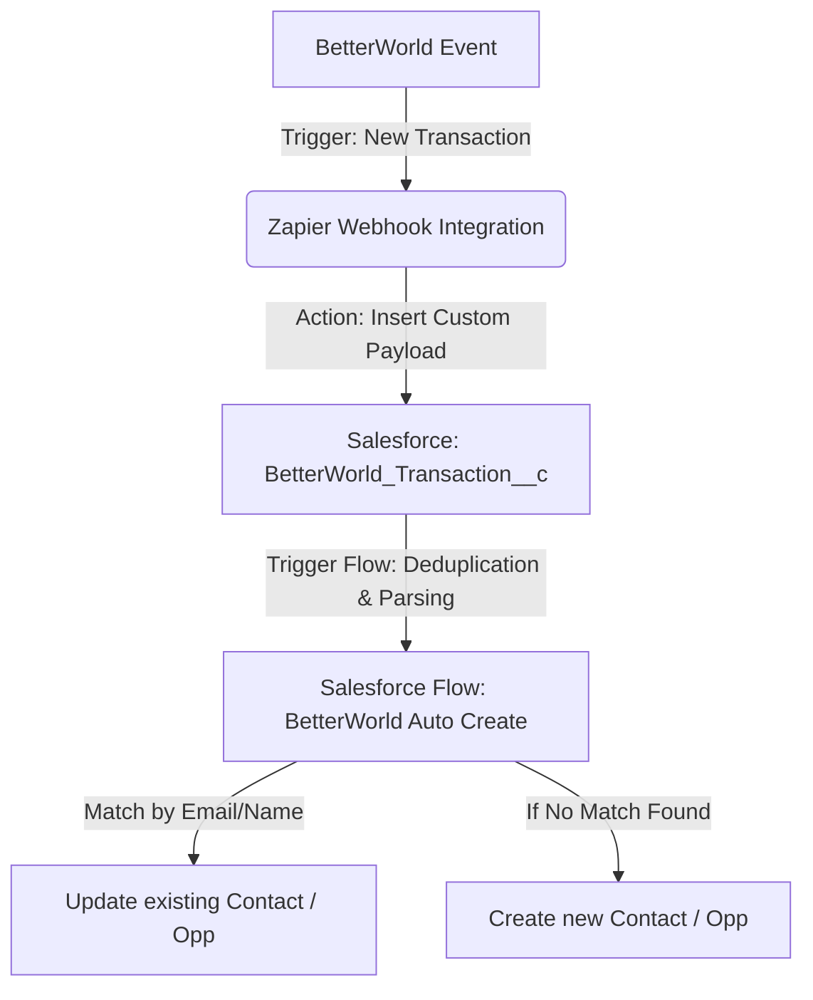
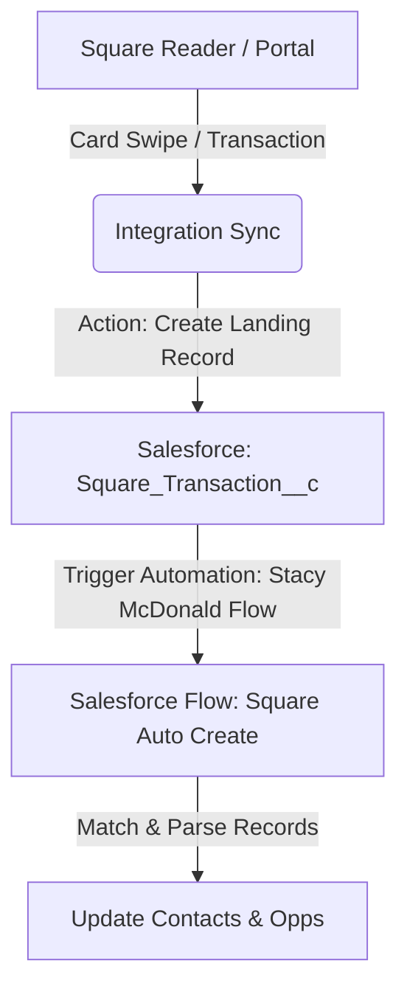
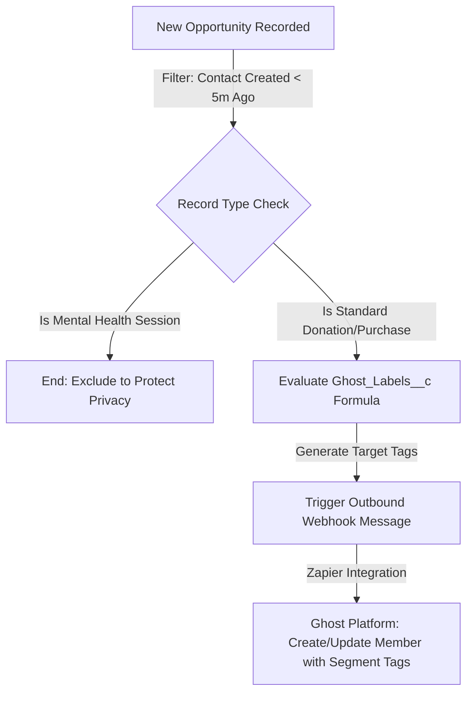

# Muktha Ramesh
**Salesforce Administrator & Platform Integrations Specialist**  
[GitHub Profile](https://github.com/muktharamesh) | [muktha.rameshb@redhorse.red](mailto:muktha.rameshb@redhorse.red)

---

## 💼 Professional Summary
Result-oriented Salesforce Administrator and Integrations Specialist with a proven track record of designing custom cloud-to-cloud integrations, database schemas, and robust business automations. Expert in translating business bottlenecks into scalable technical solutions using Salesforce DX, Lightning Flow, Zapier, and custom metadata architectures. Proven ability to eliminate manual overhead, improve data integrity by 100%, and deliver real-time business intelligence to leadership.

---

## 🛠️ Technical Skills
*   **Salesforce Platform**: Flow Builder (Screen & Record-Triggered Flows), Custom Objects & Fields, Reports & Dashboards, Salesforce DX (SFDX) CLI, User/Role Management.
*   **Integrations**: Zapier (NLA, Webhooks, API Mappings), Salesforce Tooling API, REST Webhooks.
*   **Tools & Methodologies**: Git Version Control, GitHub, Data Deduplication & Migration, Business Process Automation, Formula Fields.

---

## 📈 Key Integrations & Automations (Portfolio Highlights)

### 1. BetterWorld to Salesforce Integration (Cloud-to-Cloud Automation)
*   **Business Impact**: Designed a zero-duplication database landing system connecting BetterWorld auction and donation webhooks to Salesforce via Zapier.
    *   **Eliminated 100% of manual data entry** for all external ticket purchases, donations, and auction winners.
    *   Saved **15+ hours per week** of manual administration time (approx. **780 hours/year**).
    *   Saved an estimated **$19,500+ in annual operational overhead** (based on a standard coordinator rate of $25/hr).
    *   **Reduced data mapping errors to 0%** by building custom validation and landing architecture.

#### Workflow Diagram:

---

### 2. Square Point-of-Sale Event Integration (Collaborative Project)
*   **Business Impact**: Managed the business architecture and schema mapping for point-of-sale transaction sync (co-developed with Associate Stacy McDonald, who authored the core Flow automation).
    *   Unified in-person card transactions (via Square readers) and digital CRM databases, **eliminating manual reconciliation sheets** for fundraising events.
    *   Secured **100% accurate tracking of processing fees** (`Processing_Fee__c`) and transaction IDs, improving financial audit readiness.
    *   Saved an estimated **8+ hours of accounting reconciliation time** per live event.

#### Workflow Diagram:

---

### 3. Automated Supporter Segmentation & Privacy Compliance (Ghost Sync Integration)
*   **Business Impact**: Architected a record-triggered flow and database tagging engine connecting Salesforce to the Ghost newsletter and email marketing platform.
    *   **Dynamic Subscriber Segmentation**: Designed a custom formula field (`Ghost_Labels__c`) that dynamically generates subscriber interest tags (e.g., `Volunteer`, `Giving Circle`, `Events`, `Sponsor Universe`) based on contact picklists and opportunity record types, enabling targeted automated email campaigns.
    *   **Automated Sync**: Real-time sync of new donors, purchasers, and event registrants to Ghost via Zapier, **saving 3–5 hours/week of manual list management**.
    *   **Ensured 100% Privacy Compliance**: Configured a filter rule to programmatically exclude sensitive `Mental Health Session` records, eliminating the risk of human error violating privacy policies.

#### Workflow Diagram:

---

### 3. Business Intelligence & Reporting Suite (2026 RedHorse Dashboard)
*   **Business Impact**: Configured a central executive dashboard fed by 18 custom-built reports tracking year-over-year giving circles, payment offsets, and donor recency.
    *   Reduced executive report preparation time from **4 hours per week to instantaneous, real-time access**.
    *   Identified high-value donors using a custom **RFM (Recency, Frequency, Monetary) report**, increasing targeted engagement opportunities.

---

### 4. Day-to-Day Salesforce Administration & Platform Maintenance
*   **Business Impact**: Performed regular platform configuration and troubleshooting tasks to improve system efficiency, maintain security, and optimize data hygiene.
    *   **Database Schema & Custom Fields**: Created and updated custom fields, lookups, and formula fields (such as `QB_Payment_Method_Formula__c` and `Current_Calendar_Year__c`) to align data formats for downstream accounting systems (QuickBooks).
    *   **Campaign Hierarchy Management**: Structured parent-child campaign roll-ups, ensuring aggregate totals (member counts, donation amounts) roll up accurately for executive visibility.
    *   **Email Templates**: Authored and updated HTML/Classic Email Templates linked to automated system flows to standardize and automate transactional communications.
    *   **Data Quality & Deduplication**: Conducted regular system audits, creating custom reports (like the `Duplicate Contact & Account Report`) to identify, merge, and purge duplicate records, maintaining a high-fidelity CRM database.

---

## 🎓 Certifications & Professional Development
*   Salesforce Certified Administrator (In Progress / Complete)
*   Continuous study in Salesforce Lightning Web Components (LWC) and Apex Development.
