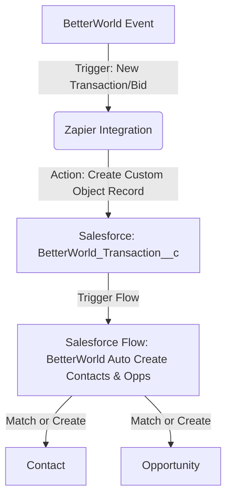

# Zapier Integrations

This directory documents the external Zapier integrations that connect cloud services to my Salesforce org. These integrations serve as the initial data ingestion point before custom Salesforce flows handle internal record matching and deduplication.

---

## ⚡ BetterWorld to Salesforce Integration

*   **Zapier Template Link**: [Use betterworld to salesforce template](https://zapier.com/templates/details/betterworld-to-salesforce-4c11ae?secret=MTp0ZW1wbGF0ZTp4RjMxVkNwSnFKa0pOMEhZdE9iMl91cWhEbnpuejdaTkNJX1g0TWpIWlJFOmd1bmJ6aA)
*   **Business Case**: Automatically import ticket sales, general campaign donations, and auction participant data from BetterWorld into Salesforce to maintain real-time campaign statistics and donor histories without manual entry.

### 🔄 Data Flow Architecture

### 📋 Integration Details

#### 1. Trigger: New Event in BetterWorld
*   **Event App**: BetterWorld
*   **Trigger Event**: New Ticket Purchase, New Auction Winner, or New Donation.
*   **Payload Captured**:
    *   `Amount` & `Net Amount`
    *   `Donor Name` (First and Last Name)
    *   `Email` & `Phone`
    *   `Category` (e.g., ticket, donation, auction)
    *   `Campaign Name`
    *   `Transaction Date`

#### 2. Action: Create Record in Salesforce
*   **Action Event**: Create Record (Custom Object: `BetterWorld_Transaction__c`)
*   **Field Mapping**:
    *   `Amount__c` ⬅️ BetterWorld Amount
    *   `Net_Amount__c` ⬅️ BetterWorld Net Amount
    *   `Donor_Name__c` ⬅️ BetterWorld Name
    *   `Email__c` ⬅️ BetterWorld Email
    *   `Phone__c` ⬅️ BetterWorld Phone
    *   `Category__c` ⬅️ BetterWorld Category (ticket, auction, etc.)
    *   `Transaction_Date__c` ⬅️ BetterWorld Date
    *   `BetterWorld_Id__c` ⬅️ BetterWorld Transaction ID

---

## 💡 Key Architectural Decision: Landing Tables
Instead of having Zapier create Contacts and Opportunities directly (which can lead to massive duplication problems), this integration uses a **Landing Table pattern**:
1. Zapier dumps raw transaction data into a custom log object (`BetterWorld_Transaction__c`).
2. A native Salesforce Flow (`BetterWorld_Auto_Create_Contact_Account_and_Opp_Records.flow-meta.xml`) handles matching, deduplication rules, and record creation using native Salesforce logic.
3. This keeps the Zap simple, reliable, and prevents duplicate records.
